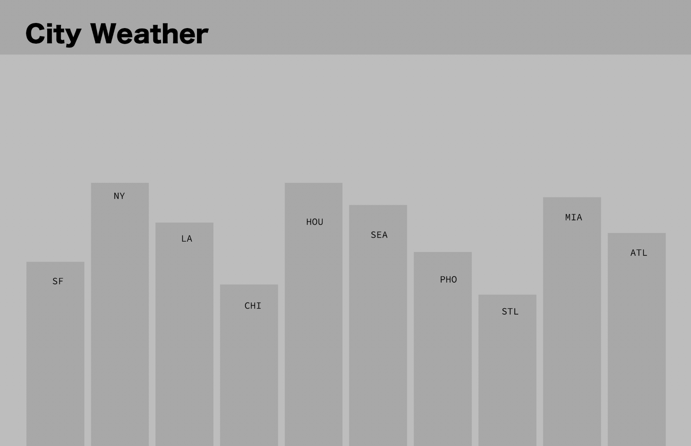

# city_weather
## App that displays the current weather in major cities across the U.S. 

*Pull weather data from openweathermap.org*
API info here: https://openweathermap.org/current#name

Parameters:
id City ID
Examples of API calls:
api.openweathermap.org/data/2.5/weather?id=2172797

### API City IDs for Project: 
* Seattle: 5809844
* San Francisco: 6621230
* New York City: 5128638
* St. Louis: 6157004
* Denver: 5419384

wireframe mockup:
